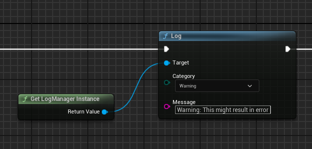

# `UCLogManager` Usage Guide

This guide provides instructions on how to use the `UCLogManager` class for logging in Unreal Engine projects. The `UCLogManager` offers a versatile system for logging messages with various categories, reading log entries, and managing log files.

## LogManager Functionality Overview

The `LogManager` operates on a separate thread, ensuring that logging operations do not block the main execution flow of the application. This threaded approach tries to ensure that the log will not affect gameplay, even when dealing with a significant volume of log messages. 

Additionally, the `LogManager` guarantees that all messages in the print queue are outputted before the application closes. If the application begins its shutdown process and there are still pending log messages, the `LogManager` will process the entire queue, ensuring that no important information is lost during shutdown.

## Using `UCLogManager` in C++

### Logging Messages

You can log messages using predefined macros for convenience, which support automatic categorization and message formatting with optional arguments.

- **General Logging:**
  ```cpp
  LOG(Category, "Message format", args...);
  ```
  
- **Specific Categories:** Use these macros for logging under specific categories:
  - Info: `LOG_INFO("Message format", args...);`
  - Warning: `LOG_WARNING("Message format", args...);`
  - Error: `LOG_ERROR("Message format", args...);`
  - Gameplay: `LOG_GAMEPLAY("Message format", args...);`
  - Network: `LOG_NETWORK("Message format", args...);`
  
  Example:
  ```cpp
  LOG_WARNING("This is a warning message with a number: %d", 42);
  ```

### Reading Logs and Log Manipulation

- **Get All Log Entries:**
  ```cpp
  TArray<FString> Entries = UCLogManager::GetAllLogEntries();
  ```
- **Get Logs by Category:**
  ```cpp
  TArray<FString> InfoLogs = UCLogManager::GetAllLogEntriesByCategory(ELogCategory::LC_Info);
  ```
- **Get a Recent Log Entry by ID:**
  ```cpp
  FString RecentLog = UCLogManager::GetRecentLogEntry(LogID);
  ```
- **Rotate the Log File:**
  ```cpp
  UCLogManager::RotateLogFile();
  ```

### Managing the Logger

- **Start Up the Logger:**
  ```cpp
  UCLogManager::StartUp();
  ```
- **Shut Down the Logger:**
  ```cpp
  UCLogManager::ShutDown();
  ```
- **Access the Logger Instance:**
  ```cpp
  UCLogManager* Logger = UCLogManager::Get();
  ```

## Using `UCLogManager` in Unreal Engine Blueprints

### Logging Messages

- Use the **Log** node available in Blueprints, specifying the log category and message as inputs.

### Reading Logs and Log Manipulation

- **Read All or Category-Specific Log Entries:** Use the **Read Log** or **Read Log By Category** nodes.
- **Get a Recent Log Entry by ID:** Use the **Get Recent Log Entry** node.
- **Rotate the Log File:** Use the **Rotate LogFile** node.

### Accessing the Logger Instance

- Use the **Get Logger Instance** node to retrieve the singleton instance of the logger.

## Accessing `UCLogManager` from AngelScript

### Getting the Logger Instance

First, acquire the singleton instance of `UCLogManager`:

```angelscript
UCLogManager@ logger = UCLogManager::Get();
```

### Logging Messages

Call the `Log` function on the logger instance, specifying the category and message:

```angelscript
logger.Log(UCLogManager::ELogCategory::LC_Info, "This is an informational message");
```

This guide aims to ensure consistent logging practices across C++, Blueprints, and potentially AngelScript within your Unreal Engine project.

## Blueprint Logging Examples and Results

Below are the examples of how the logging is to be used from Blueprints and the results in the Editor Log from the logging.

### Examples of Logging from Blueprints

- **Logging an Info Message:**  
    
  `BlueprintLogInfo.png` in the ScreenShots folder.

- **Logging a Warning Message:**  
    
  `BlueprintLogWarning.png` in the ScreenShots folder.

- **Logging an Error Message:**  
    
  `BlueprintLogError.png` in the ScreenShots folder.

### Results in the Editor Log

- **Output of Logged Messages:**  
    
  `UELogResults.png` in the ScreenShots folder.

## Reading Logs in Blueprints

### Reading Logs by Category

To read log entries of a specific category within Blueprints, follow these steps:

1. Use the **Get LogManager Instance** node to get the `UCLogManager` instance.
2. Call the **Read Log By Category** node with the desired category.
3. Loop through the results using a **For Each Loop**, and print them using a **Print String** node for display in the editor.

Example Blueprint:  
  
`BlueprintReadCategoryLog.png` in the ScreenShots folder.

### Reading All Logs

To read all log entries:

1. Use the **Get LogManager Instance** node to get the `UCLogManager` instance.
2. Call the **Read Log** node to retrieve all log entries.
3. Loop through the results using a **For Each Loop**, and print them using a **Print String** node for display in the editor.

Example Blueprint:  
  
`BlueprintReadFullLog.png` in the ScreenShots folder.

## Blueprint Log Read Results

### Results of Reading Category Specific Logs

After executing the Blueprint to read logs by category, the printed strings can be seen in the editor.

Example of Output:  
  
`ResultReadCategoryLog.png` in the ScreenShots folder.

### Results of Reading All Logs

Similarly, after executing the Blueprint to read all logs, the printed strings appear in the editor.

Example of Output:  
  
`ResultReadFullLog.png` in the ScreenShots folder.
