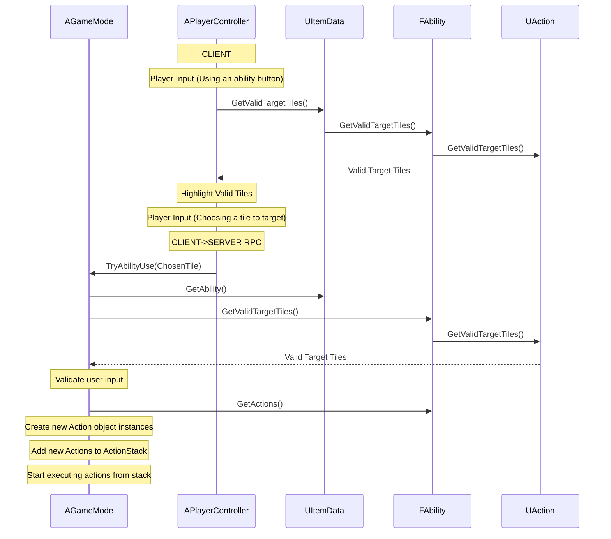
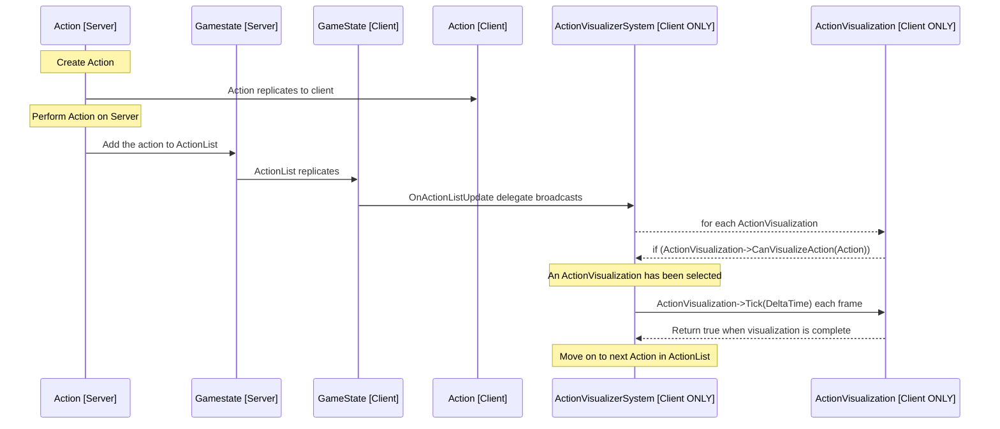

# Graduation Project Report, Anton Hedlund

## Keywords
Engine: Unreal Engine 5, C++, AngelScript by HazeLight, Epic Online Services.
\
Teamwork: GitHub, Jira.
\
Details: 10 weeks, 5 programmers.

## Table of contents
- [Introduction](#introduction)
- [Project Startup](#project-startup)
- [Weekly Summary](#weekly-summary)
- [Outcome](#outcome)

## Introduction
This is a report regarding a ten week long graduation project at FutureGames Stockholm. The project took place from April 18th to May 24th, 2024.

The personal goals I set for my project were:

- Further familiarization with Unreal Engine, and specifically with the AngelScript engine version supported by Hazelight, which is being used in a few different studios in Stockholm.
- Gaining experience in a team with several programmers, as it is going to be a very important aspect of working within the industry, and in our previous Game Projects at FutureGames I have only worked in teams of 2 programmers.
- Solidifying my skills in networked gameplay, which has been one of the areas of development I've enjoyed the most, as well as the skill I believe has made me stand out the most among potential internship companies.

As I wanted to work in a team, I was in touch with a few of my co-students who were also interested in a team project within Unreal Engine. We ended up with a team of 5 students; [Me](https://www.antonhedlund.com/), [Erik Lund](https://lunderik.wixsite.com/portfolio), [Johan Brandt](https://www.johanbrandt.com/), [Alice Kamil](https://alicekamil.com/), [Theo Sandén](https://www.theosanden.com/)

## Project Startup
### Goals, team and individual
Very early in our team's discussions, we decided on making a tactical game, something akin to board games like Descent, Gloomhaven or Warhammer: Quest. We decided on a few key features that were core to our game and our respective individual goals for the project:

- Networked multiplayer supporting 1-4 players
- Gameplay does not depend on number of players - if only 1 player plays the game, they control 4 units. For 3 players, the host controls unit 4
- A command-pattern approach to game actions, to allow for a player to undo and reconsider any action taken during their turn
- An MVC pattern approach to visual effects, with server-authoritative game state changes but entirely client-owned visual information
- A procedurally generated game grid board and loot system, using a seed for all random elements.
- Using Unreal Engine's GameplayTag system for programming gameplay
- A unit system where hero units and enemies function identically, so that the AI interacts with the game as a player would. This would build the foundation to potentially introduce "mind-control" effects for both AI and player

### [Style guide](https://github.com/AntonHedlundFG/GraduationProject/blob/main/Docs/Naming%20Conventions/README.md)
Before work started on any code, we sat down and decided on a few basic principles for how to style our code consistently across the team.

For example, since we were going to use C++ and AngelScript side-by-side, we decided to name any class implemented natively in C++ with a C following the default Unreal naming convention (i.e. ACMyActor or UCMyObject.) For classes implemented in AngelScript, we instead used an S (ASMyActor, USMyObject). 

### Early week-by-week plans
As part of the first few days of the project being spent on planning our work and deciding on what game we would be making, we established this as a week-by-week plan. Note that this was *preliminary*, and not written in stone.

1. Planning
2. First playable
3. Pre-Alpha
4. Alpha
5. Pre-Beta
6. Beta (Feature Complete)
7. Content
8. Release Candidate
9. Polish
10. Presentation & Report writing

### Considerations and limitations
With neither designers nor artists involved in the project, we went into the project not striving to make a complete game, but rather a functioning prototype which has the systems required to build a game upon. This was also what we kept in mind when deciding on what game to make - a very system heavy one.

It was important for me to make a game which supports online multiplayer, but we opted to not publish the game and instead only work in a development environment. With Epic Online Services, this meant that only Epic accounts that were manually added to our development team could log in and host/join sessions. Since we not intending to make a complete game, we did not want to spend the 100$ required to publish, especially early on in the project when there were still many uncertainties.

### Individual responsibilities
We did not intend to have rigid team roles, but de facto, as the project progressed, certain core systems naturally fell under the ownership of specific team members. The major systems I had responsibility for were

- Online functionality, hosting and joining sessions, replication
- Server-authoritative turn order system and a replicated Command Pattern-style Action system with Undo functionality
- Client-managed Visualization system for replicated server Actions, using a Strategy Pattern to create visual effects depending on which Action is visualized.

### Mentors [TODO: Ask mentors if they want me to link to their websites or mention anything]
As the school provided a budget for one hour of mentoring per student per week, we decided as a group to reach out to two mentors to divide our weekly five hours between.
#### Marc Zaku
Marc was our teacher in the Programming Design Patterns course. Since our game was going to be a very logic-heavy game we needed our core game architecture to be solid, and because of this we believed Marc would be able to do an excellent job as a mentor for the team. 
#### Ian Bradley
Ian had mentored our class in a much earlier course on C++, and has plenty of experience working within Unreal Engine. We hoped that as a mentor he could help us with general questions about Unreal, as well as general game development and team issues.

## Weekly Summary

This is a weekly summary of my work on the project. I will not go into details about the work other team members did, that information can be found in their respective reports.

### Week 1, Starting Up
Much of the first week was spent on various planning meetings including the whole team. The output of these meetings was mostly to align the team members' understanding of the project as a whole, but also a couple of images of whiteboard writings outlining our planned work. Most of the information detailed in [Project Startup](#project-startup) was generated during these meetings.


This week we set up the actual development environment, generating the Unreal project, setting up our GitHub repository, and making sure the entire team had downloaded the AngelScript version of Unreal as developed by Hazelight.

My first few commits included adding a subsystem for hosting and joining sessions through Epic Online Services, which I had made earlier for another project. I also set up the necessary settings to make this work, setting up our Epic Developer Portal and adding the relevant codes to Unreal.

I started working on an initial implementation of the command pattern that was to be used for our gameplay, with a UObject named UCommand for the active behaviour generated by players and AI, and UConsequences which basically function in the same way but which are stored within a UCommand instead. This would make it easy to make sure that when a player undoes their last action, all resulting consequences are undone in exactly the inverse order.

This is a cleaned up version of the initial command class. The BlueprintImplentableEvents named with Receive-prefixes are required to enable AngelScript implementations of the virtual functions, as AngelScript cannot call the native Super:: implementation of an overridden function.

``` c++
UCLASS(Abstract)
class UCCommand : public UObject
{
public:
	virtual void ExecuteCommand(AController* inController) { ReceiveExecuteCommand();}
	virtual void UndoCommand() { ReceiveUndoCommand(); }
	virtual FString ToString() { return ReceiveToString(); }

protected:
	UFUNCTION(BlueprintImplementableEvent)
	void ReceiveExecuteCommand();
	UFUNCTION(BlueprintImplementableEvent)
	void ReceiveUndoCommand();
	UFUNCTION(BlueprintImplementableEvent)
	FString ReceiveToString();
};
```

#### Miscellaneous
- LevelURL asset which keeps a map of URL's to all relevant game levels (Main Menu, Lobby, transition level, Game level), and appends requested settings as optional parameters to the URL.
- GameMode implementation of basic command pattern flow, with client-side PlayerControllers making Server RPC's to activate abilities on the server.
- Default player Pawn, containing only a camera, with movement through WASD keys, edge-of-screen scrolling and by holding down the mouse scroll wheel.
- Basic UI for using abilities, undoing abilities and ending the player's turn, as well as hotkeys. For targeted abilities, I implemented a simple linetrace function for choosing a tile to target.
- Basic movement ability and basic attack ability

### Week 2, Command Pattern improvements
Development speed slowed down drastically this week as the team started weaving together many unconnected systems. 

I implemented a basic health system for units, and the first UConsequence implementation, which was UDeathConsequence. It would be created when a unit reached 0 health, and removed the unit from the game board as well as the turn order list. When a UCommand which triggered the UDeathConsequence was undone, the consequence was undone as well, returning the unit to the board where it was, restoring the health it lost, as well as inserting it into the turn order list to its previous position.

This week we also moved away from the basic command pattern flow and implemented a more generic one using UActions. The actions have the same functionality as UCommands and UConsequences, but can also have a relationship with an ActionComponent attached to each Unit. The new UActions also use Unreal Engine's GameplayTags.

We implemented an item system, where each item would contain an ability which can be used to create a series of UActions, as well as an InventoryComponent attached to each Unit, where items could be equipped and removed.

Finally, I implemented a Timer subsystem for our game. Since our game does not play in real time, Unreal Engine's regular real time-based FTimerManager cannot be used for gameplay. Instead my TurnTimer implementation can be used to set a timer to call a delegate function after a specific amount of game turns.

As with all functionality in our game, if an action setting this timer is undone, it must also undo the setting of the timer. The result of a timer finishing can never be undone, as it is not caused directly by a player action.

```c++
UFUNCTION(BlueprintCallable, Category = "Turn Timer")
	FTurnTimerHandle SetTimer(
        const int InNumberOfTurns, 
		ACUnit* InAffectedUnit,
		const bool InbLoop, 
		const EProgressTurnMethod InProgressTurnMethod, 
		FOnTurnTimerExecute InDelegate);

        //Example use which will run SomeFunction at the start of SomeUnit's second next turn. If the third parameter was true, SomeFunction would repeatedly be called every other turn.
        FTurnTimerHandle Handle = 
        SetTimer(2, SomeUnit, false, EProgressTurnMethod::PTM_StartOfTurn, &UThisClass::SomeFunction)
```

### Week 3, UObject Replication

Almost the entire week was spent on recreating old functionality in the new system using UActions. It was a somewhat frustrating week with a feeling of "one step forward, two steps back", but by the end of it almost everything was back in place, and much improved.

I spent some time this week researching how to make Unreal Engine's UObjects replicate properly, as they do not do so by default, as well as how replicated TArrays of pointers to replicated UObjects work, and how often they trigger their respective OnRepNotify functions.

I was surprised to see that when creating a new replicated UObject and adding it to a replicated TArray in the same frame, the client's OnRepNotify function is still called twice; first to notify the client of the array's increased size, then to actually add the valid pointer.

Finally, implementing the new UAction system was very difficult, and I had a hard time communicating the workflow to the rest of the team. Our mentor Marc suggested I write a sequence diagram using mermaid to describe the information flow. I had never made one before, but this is my implementation:



### Week 4, General Gameplay

Most of this week was dedicated to implementing more general gameplay functionality:

- Item Charge system, so that a unit's abilities can only be used once each turn (or more, if items allow it)
- Unit names, displayed and replicated
- Ability UI improvements with visual indicators of targetable tiles
- Rudimentary Victory and Failure conditions
- "Cheating" UI for easier testing, with instant win and infinite Item Charge buttons.
- Replication of the game chat log for gameplay messages.

This week the team held a small workshop where I showed the team how to implement new items and abilities, and we all made a few of them to populate the game with some content.

Finally, towards the end of the week I focused on making a playable build, with all the debugging and minor error fixing required.

### Week 5, Absent

This week I was sick for the first half, and away from work for a surgery for the second half. I was not able to do any work. Thankfully, there were no major features or bugs that relied on my presence, and the rest of the team were able to continue working without issue.

### Week 6, Action Visualization

So far, all item abilities were entirely logical, and when used the state would instantly update accordingly. There were no movement animations or visual effects for attacks. This week I spent on implementing a UActionVisualizationSystem subsystem.

The system is entirely local, and uses a strategy pattern to create visual interpretations (UActionVisualization) based on the server-authoritative replicated list of UActions available in the GameState, which determine actual state.

Here is a sequence diagram showcasing the flow of information in the ActionVisualizer: 



The header file for UActionVisualization in its cleaned up form:
```c++
UCLASS(Blueprintable)
class TACTICALROGUELITE_API UCActionVisualization : public UObject
{
	friend UCActionVisualizerSystem;

protected:

	//Called by the VisualizerSystem to determine if this visualization is suitable for the designated Action.
	UFUNCTION(BlueprintNativeEvent, Category = "Actions")
	bool CanVisualizeAction(UCAction* Action);

	//Called by the VisualizerSystem when visualizing of this this visualization begins 
	UFUNCTION(BlueprintNativeEvent, Category = "Actions")
	void Enter();

	//Called each frame by the VisualizerSystem once visualization has begun.
	//When this function returns true, the visualization is complete and the system moves on to another one.
	UFUNCTION(BlueprintNativeEvent, Category = "Actions")
	bool Tick(float DeltaTime);

	//If an action has been undone, the VisualizerSystem will call RevertTick, and it should function just like Tick - but in reverse.
	UFUNCTION(BlueprintNativeEvent, Category = "Actions")
	bool RevertTick(float DeltaTime);

};
```

The UActionVisualizerSystem itself is far more complex, since it needs to keep track of the list of performed and undone actions stored in the GameState, while taking into account the tricky aspects of TArray replication mentioned in [Week 3](#week-3-uobject-replication). It keeps a list of all available UActionVisualizations and, in order, asks each one if they CanVisualizeAction(Action). If it can, the system creates an instanced copy of the visualization, and adds it to a queue, which is then iterated through each Tick. 

Other features implemented this week:
- A shader for unit sprites which is a billboard variant but which only rotates along the Z axis.
- Several generic implementations of UActionVisualization, for movement abilities, basic attacks, and unit death and resurrection.
- Visual indicator arrow for the currently active unit.


### Week 7

I started this week by writing the first draft for the first half of this project report, including the introductions and the weekly diary.

At this point, most of the major systems are already in place and the focus of our development was on improving the existing ones and adding content.

A major overhaul was done to our Attribute system to allow the items' actions to fetch relevant values from the unit's AttributeSet via it's AttributeComponent, instead of storing the values in the actions themselves. For example, instead of the BasicMeleeWeapon dealing 2 damage, it now grants the player +2 to "Attribute.WeaponDamage" while equipped, and then uses that Attribute to determine damage. The same applies to "Attribute.MovementRange" and "Attribute.AttackRange". This approach is a lighter version of how UnrealEngine's GameplayAbilitySystem handles Attributes.

After the shift to the new Attribute system, many Actions no longer worked, as they relied on the old system. The rest of the week was spent updating these Actions' implementations to the new system.

### Week 8

This week was one of fixing minor bugs. Resurrecting units and moving them forward to the next room on opening had stopped working after the new Attribute system was added, so it had to be reworked.

I updated the logic of the Movement action, so that it no longer "teleported" the active unit to its destination, instead letting the server generate an actual path, which in turn could be replicated and visualized by each client.


### Week 9

The last week of development, in which we were playtesting and fixing bugs every day. The most important change was to update the Turn Order system in the Game Mode, such that it was no longer a simple publicly available array of units - instead making it a more robust system. This was required for bugs related to units dying on their turn, which up until now had not been supported.

For the sake of easy playability, we packaged a variant build, which only allowed for local solo play. This was required since we have not published our game on the Epic Store, which means only Epic accounts which have been manually added to our development team can log in. Some improvements were made to the character selection UI to make solo play more cohesive, such as not requiring every unit to be "Ready" to start the game.

One major issue we had this week was related to AngelScript. UObjects defined in C++ and extended in AngelScript were not replicating the properties declared in AngelScript - even with the appropriate UPROPERTY(Replicated) tag. Luckily, we were able to get support in the official Discord channel from a developer at Envar Studio who had previously had the same issue. The lifetime replication list needed to be extended to include the script properties:
```c++
void UCAction::GetLifetimeReplicatedProps(TArray<FLifetimeProperty>& OutLifetimeProps) const
{
	Super::GetLifetimeReplicatedProps(OutLifetimeProps);
	DOREPLIFETIME(UCAction, ActionComp);
	DOREPLIFETIME(UCAction, bIsUndone);

	//Add properties declared in AngelScript to the list of replicated properties
	if (GetClass()->ScriptTypePtr != nullptr)
	{
		GetClass()->GetLifetimeScriptReplicationList(OutLifetimeProps);
	}
}
```

### Week 10

The last week of the project was spent entirely on writing this report as well as other relevant administrative work - adding the project to my portfolio, writing a README for GitHub as well as uploading the build to itch.io.

## Outcome

### Initial Planning vs. Final Outcome

With a project like this, you have to expect that your plans will change, and that some goals will be scrapped and others added along the way. I was, however, surprised to see how closely our final outcome aligned with our initial projections. 

As for the [Individual Goals](#introduction) I set at the start of the project, I was happy to be able to fulfill them. 

- Our game made heavy use of replicated UObjects, and I learned a lot about how Unreal Engine's replication works while implementing our Action & Visualization systems. 
- With a team of 5, I definitely got the team working experience I wanted. It was the first time in a game project I was not able to keep up with the entire code base, and we all had to be much more deliberate about making sure our systems were not just functional, but also easy to use.
- Although we did not make heavy use of AngelScript, we used it enough to get a solid grasp on what we needed to do in our native C++ code to make sure both AngelScript and Blueprints were supported properly.

All our [Team Goals](#goals-team-and-individual) were also fulfilled, although some of the features were very rudimentary - like the procedurally generated game board.

We were able to follow our [Week-By-Week plan](#early-week-by-week-plans) for the first half of the project, but we were lagging behind somewhat towards the end. The main reason for this was that we had to rework our Action- and Attribute-systems from our rudimentary first versions to more advanced variants that resemble the Unreal Engine Gameplay Ability System's implementation. These changes required us to redo a lot of work, which was very frustrating at times. Had we implemented the more advanced versions right away, the initial work would have been delayed, but in the long run we might have saved time. However, considering none of us had extensive experience with the advanced version at the start of the project, I am fairly content with our approach.

### Challenges


### Learnings