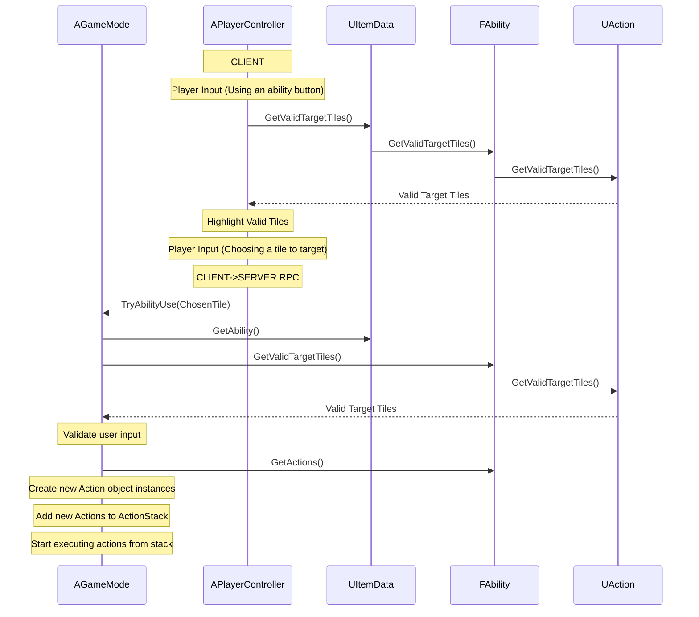

```mermaid 
sequenceDiagram
participant GM as AGameMode
participant PC as APlayerController
participant ID as UItemData
participant Ability as FAbility
participant Action as UAction

Note over PC: CLIENT
Note over PC: Player Input (Using an ability button)
PC->>ID: GetValidTargetTiles()
ID->>Ability: GetValidTargetTiles()
Ability->>Action: GetValidTargetTiles()
Action-->>PC: Valid Target Tiles
Note over PC: Highlight Valid Tiles

Note over PC: Player Input (Choosing a tile to target)
Note over PC: CLIENT->SERVER RPC
PC->>GM: TryAbilityUse(ChosenTile)
GM->>ID: GetAbility()
GM->>Ability: GetValidTargetTiles()
Ability->>Action: GetValidTargetTiles()
Action-->>GM: Valid Target Tiles
Note over GM: Validate user input

GM->>Ability: GetActions()
Note over GM: Create new Action object instances
Note over GM: Add new Actions to ActionStack
Note over GM: Start executing actions from stack
```
