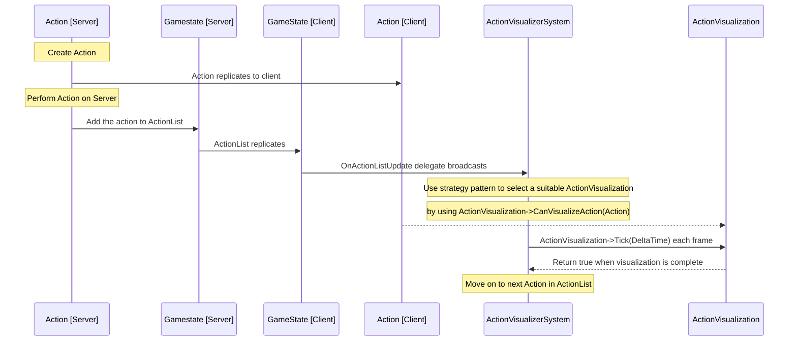

```mermaid
sequenceDiagram

participant AS as Action [Server]
participant GSS as Gamestate [Server]
participant GSC as GameState [Client]
participant AC as Action [Client]
participant AVS as ActionVisualizerSystem
participant AV as ActionVisualization

note over AS: Create Action
AS->>AC: Action replicates to client
note over AS: Perform Action on Server
AS->>GSS: Add the action to ActionList
GSS->>GSC: ActionList replicates
GSC->>AVS: OnActionListUpdate delegate broadcasts
note over AVS: Use strategy pattern to select a suitable ActionVisualization
note over AVS: by using ActionVisualization->CanVisualizeAction(Action)
AC-->>AV: 
AVS->>AV: ActionVisualization->Tick(DeltaTime) each frame
AV-->>AVS: Return true when visualization is complete
note over AVS: Move on to next Action in ActionList
```
