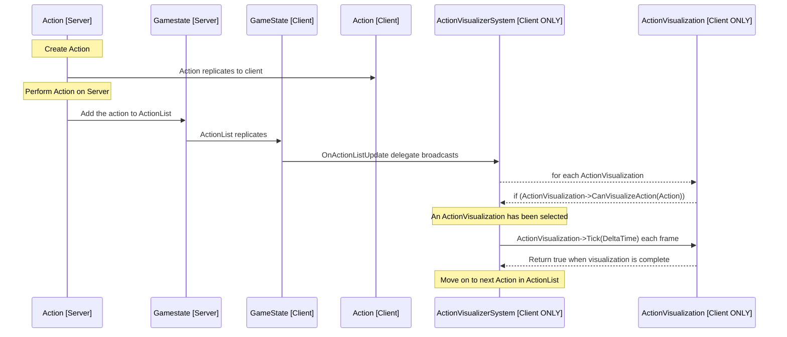

```mermaid
sequenceDiagram

participant AS as Action [Server]
participant GSS as Gamestate [Server]
participant GSC as GameState [Client]
participant AC as Action [Client]
participant AVS as ActionVisualizerSystem [Client ONLY]
participant AV as ActionVisualization [Client ONLY]

note over AS: Create Action
AS->>AC: Action replicates to client
note over AS: Perform Action on Server
AS->>GSS: Add the action to ActionList
GSS->>GSC: ActionList replicates
GSC->>AVS: OnActionListUpdate delegate broadcasts
AVS-->>AV: for each ActionVisualization
AV-->>AVS: if (ActionVisualization->CanVisualizeAction(Action))
note over AVS: An ActionVisualization has been selected
AVS->>AV: ActionVisualization->Tick(DeltaTime) each frame
AV-->>AVS: Return true when visualization is complete
note over AVS: Move on to next Action in ActionList
```
